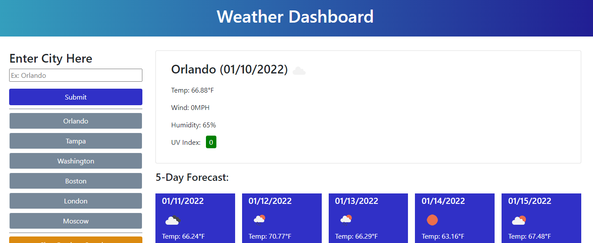
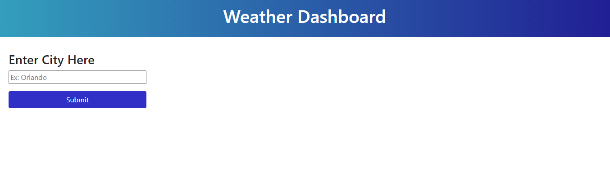
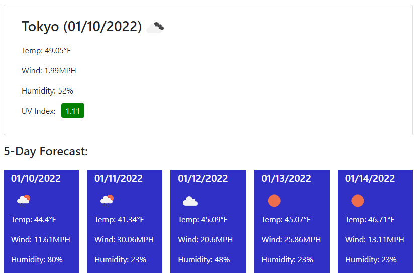
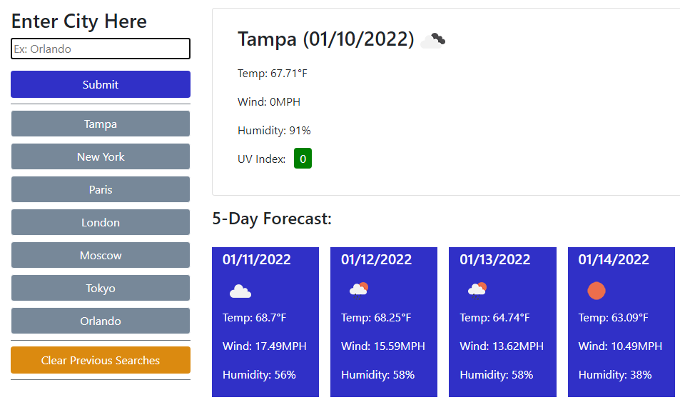

# Weather Dashboard

# Description

A project for my bootcamp to create a weather dashboard that uses data from the Open Weather Map API. This webpage lets you enter any city into the search bar, then get current weather data from that cities' location, and a 5 day forecast. The city you search is then saved onto the sidebar, and can be clicked again to pull that city back up at anytime. This list can be cleared out at anytime with the "Clear Previous Searches" button below them.

The forecast includes the temperature, wind speed, and humidity, along with the current UV index, and an icon showing the cloud pattern and if it is raining.

# Extensions and API's Used

* [Open Weather One Call API](https://openweathermap.org/api/one-call-api)
* [Open Weather Geocoding API](https://openweathermap.org/api/geocoding-api)
* Bootstrap
* JQuery
* [Moment.Js](https://momentjs.com/)

# Webpage Link

[Please click here to view the webpage.](https://wruback.github.io/WR-weather-dashboard/)

# Webpage Appearance

